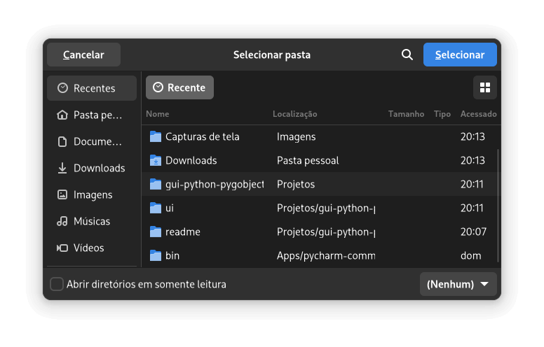
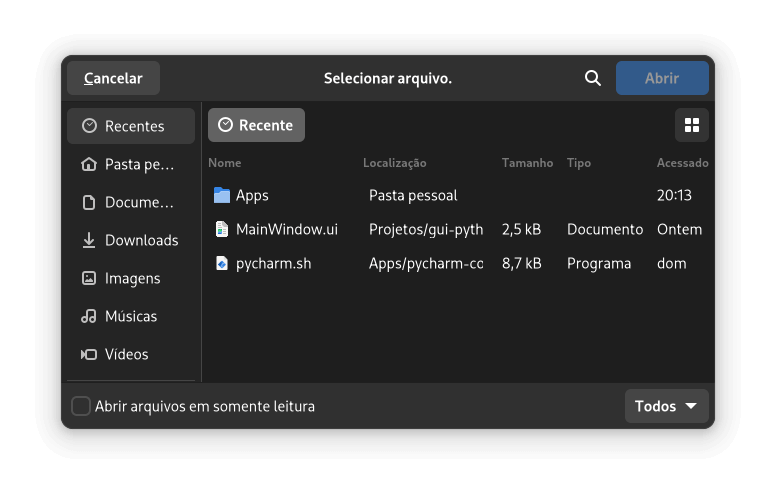
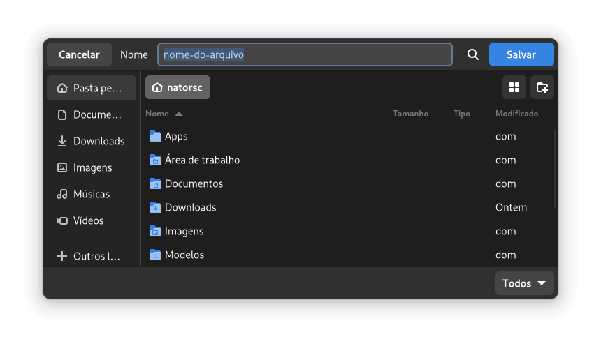
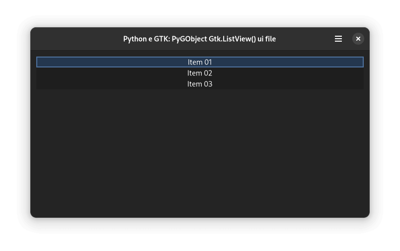
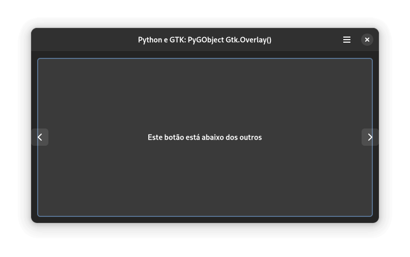
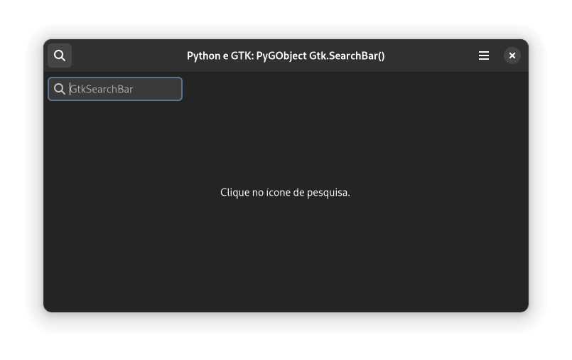

 e GTK")

<br>

[](https://github.com/natorsc/gui-python-pygobject-gtk "Ir para o repositório.")
&emsp;
[](https://github.com/natorsc/gui-python-pygobject-gtk)
&emsp;
[](https://github.com/natorsc/gui-python-pygobject-gtk)

[](https://github.com/natorsc/gui-python-pygobject-gtk)

# Criando interfaces gráficas com Python (PyGObject) e GTK

## 📝 Descrição

Repositório criado para documentar dicas, tutoriais e exemplos de código sobre a construção de interfaces gráficas com a linguagem de programação Python (PyGObject) e o toolkit gráfico GTK.

---

## 🛠 Tecnologias utilizadas

Até o presente momento as seguintes tecnologias são utilizadas na construção do projeto:

[](https://www.python.org/ "Ir para o site.")
&emsp;
[](https://pypi.org/project/PyGObject/ "Ir para o PyPi.")
&emsp;
[](https://www.gtk.org/ "Ir para o site.")
&emsp;
[](https://www.gnome.org/ "Ir para o site.")
&emsp;
[](https://flatpak.org/ "Ir para o site.")

---

## 🤓 Autor

Repositório feito com 💙 por [Renato Cruz](https://github.com/natorsc) 🤜🤛 Entre em contato!

[](mailto:natorsc@gmail.com "Enviar e-mail.")
&emsp;
[](https://www.linkedin.com/in/natorsc "Acessar.")

Uma das playlist que costumo ouvir quando estou estudando ou "codando" 😁:

[](https://open.spotify.com/playlist/1xf3u29puXlnrWO7MsaHL5?si=A-LgwRJXSvOno_e6trpi5w&utm_source=copy-link "Acessar playlist.")

Sempre que possível escrevo tutoriais no meu blog pessoal 🚀:

[](https://blog.justcode.com.br/ "Acessar.")

---

## 💝 Doações

Obrigado por sua doação é através dela que consigo manter este conteúdo 😊.

### Ko-Fi

[](https://ko-fi.com/natorsc "Ajude com uma doação.")

### Pix


**Chave**: `b1839493-2afe-484d-9272-82a3e402b36f`

---

## Tutoriais

- [https://natorsc.hashnode.dev/series/gtk](https://natorsc.hashnode.dev/series/gtk).

---

## Extra

### GTK

- [Documentação GTK 3](https://docs.gtk.org/gtk3/).
- [Documentação GTK 4](https://docs.gtk.org/gtk4/).

### Libadwaita

- [Documentação 1.x](https://gnome.pages.gitlab.gnome.org/libadwaita/doc/1-latest/).

### GNOME

- [Site oficial](https://www.gnome.org/).
- [Blog](https://blogs.gnome.org/).
- [GNOME Human Interface Guidelines (HIG)](https://wiki.gnome.org/Design/HIG).


### Desenvolvimento

- [GNOME Builder](https://apps.gnome.org/pt-BR/app/org.gnome.Builder/).
- [Workbench](https://apps.gnome.org/pt-BR/app/re.sonny.Workbench/).
- [Cambalache](https://flathub.org/pt-BR/apps/ar.xjuan.Cambalache).
- [Icon Library](https://flathub.org/apps/details/org.gnome.design.IconLibrary).
- [Typography](https://flathub.org/apps/details/org.gnome.design.Typography).
- [App Icon Preview](https://flathub.org/apps/details/org.gnome.design.AppIconPreview).
- [Symbolic Preview](https://flathub.org/apps/details/org.gnome.design.SymbolicPreview).
- [Color Palette](https://flathub.org/apps/details/org.gnome.design.Palette).

### Softwares

- [GNOME Apps](https://apps.gnome.org/pt-BR/).
- [GNOME circle](https://circle.gnome.org/).
- [Awesome GTK](https://github.com/valpackett/awesome-gtk).

### Flatpak

- [Site oficial](https://www.flatpak.org/).
- [flathub](https://flathub.org/).

---

## GTK

### 🖥 Widgets

#### Gtk.ActionBar

- [Gtk.ActionBar](./src/gtk-widgets/actionbar).


#### Gtk.Application

- [Gtk.Application](./src/gtk-widgets/application).


#### Gtk.ApplicationWindow

- [Gtk.ApplicationWindow](./src/gtk-widgets/application-window).


#### Gtk.Box (horizontal)

- [box-Box (horizontal)](./src/gtk-widgets/box-horizontal).


#### Gtk.Box (vertical)

- [Gtk.Box (vertical)](./src/gtk-widgets/box-vertical).


#### Gtk.Button

- [Gtk.Button](src/gtk-widgets/button).


#### Gtk.Calendar

- [Gtk.Calendar](./src/gtk-widgets/calendar).


#### Gtk.CheckButton

- [Gtk.CheckButton](./src/gtk-widgets/check-button).


#### Gtk.CheckButton (radio)

- [Gtk.CheckButton (radio)](./src/gtk-widgets/check-button-radio).


#### Gtk.ColorDialogButton

- [Gtk.ColorDialogButton](./src/gtk-widgets/color-dialog-button).


#### Drag and drop

- [Drag and drop](./src/gtk-widgets/drag-and-drop).


#### Gtk.DropDown

- [Gtk.DropDown](./src/gtk-widgets/drop-down).


#### Gtk.Entry

- [Gtk.Entry](./src/gtk-widgets/entry).


#### Gtk.FileDialog (folder)

- [Gtk.FileDialog (folder)](./src/gtk-widgets/file-dialog-folder).



#### Gtk.FileDialog (open)

- [Gtk.FileDialog (open)](./src/gtk-widgets/file-dialog-open).



#### Gtk.FileDialog (save)

- [Gtk.FileDialog (save)](./src/gtk-widgets/file-dialog-save).



#### Gtk.Fixed

- [Gtk.Fixed](src/gtk-widgets/fixed).


#### Gtk.FlowBox

- [Gtk.FlowBox](./src/gtk-widgets/flow-box).


#### Gtk.Grid

- [Gtk.Grid](./src/gtk-widgets/grid).


#### Gtk.HeaderBar

- [Gtk.HeaderBar](./src/gtk-widgets/header-bar).


#### Gtk.Image

- [Gtk.Image](./src/gtk-widgets/image).


#### Gtk.ListBox

- [Gtk.ListBox](./src/gtk-widgets/list-box).


#### Gtk.ListView

- [Gtk.ListView](./src/gtk-widgets/list-view).



#### Gtk.MenuButton

- [Gtk.MenuButton](./src/gtk-widgets/menu-button).


Erro:

```bash
_gtk_css_corner_value_get_y: assertion 'corner->class == &GTK_CSS_VALUE_CORNER' failed
```

[Discourse](https://discourse.gnome.org/t/menu-button-gives-error-messages-with-latest-gtk4/15689).

#### Gtk.Overlay

- [Gtk.Overlay](./src/gtk-widgets/overlay).



#### Pango tags

- [Pango tags](./src/gtk-widgets/pango-tags).


#### Gtk.Picture

- [Gtk.Picture](./src/gtk-widgets/picture).


#### Gtk.PrintOperation

- [Gtk.PrintOperation](./src/gtk-widgets/print-operation).


#### Gtk.SearchBar

- [Gtk.SearchBar](./src/gtk-widgets/search-bar).



#### Gtk.ShortcutsWindow

- [Gtk.ShortcutsWindow](./src/gtk-widgets/shortcuts-window).


#### Signals and slots

- [Signals and slots](./src/gtk-widgets/signals-and-slots).


#### Gtk.StackSidebar

- [Gtk.StackSidebar](./src/gtk-widgets/stack-sidebar).


#### Gtk.StackSwitcher

- [Gtk.StackSwitcher](./src/gtk-widgets/stack-switcher).


#### Gtk.Switch

- [Gtk.Switch](./src/gtk-widgets/switch).


#### Translation (gettext)

- [Translation (gettext)](./src/gtk-widgets/translation-gettext).


#### Gtk.Video

- [Gtk.Video](./src/gtk-widgets/video).


#### Gtk.Window

- [Gtk.Window](./src/gtk-widgets/window).


---

## 📱 Libadwaita

### Widgets

- [aboutwindow](src/gtk-libadwaita-widgets/aboutwindow).
- [action-row](src/gtk-libadwaita-widgets/action-row).
- [application](src/gtk-libadwaita-widgets/application).
- [avatar](src/gtk-libadwaita-widgets/avatar).
- [button-content](src/gtk-libadwaita-widgets/button-content).
- [carousel](src/gtk-libadwaita-widgets/carousel).
- [carousel-indicator-dots](src/gtk-libadwaita-widgets/carousel-indicator-dots).
- [carousel-indicator-lines](src/gtk-libadwaita-widgets/carousel-indicator-lines).
- [clamp](src/gtk-libadwaita-widgets/clamp).
- [colorscheme](src/gtk-libadwaita-widgets/colorscheme).
- [combo-row](src/gtk-libadwaita-widgets/combo-row).
- [entry-row](src/gtk-libadwaita-widgets/entry-row).
- [expander-row](src/gtk-libadwaita-widgets/expander-row).
- [flap](src/gtk-libadwaita-widgets/flap).
- [leaflet](src/gtk-libadwaita-widgets/leaflet).
- [message-dialog](src/gtk-libadwaita-widgets/message-dialog).
- [password-entry-row](src/gtk-libadwaita-widgets/password-entry-row).
- [preferencespage](src/gtk-libadwaita-widgets/preferencespage).
- [preferenceswindow](src/gtk-libadwaita-widgets/preferenceswindow).
- [split-button](src/gtk-libadwaita-widgets/split-button).
- [status-page](src/gtk-libadwaita-widgets/status-page).
- [toast](src/gtk-libadwaita-widgets/toast).
- [viewstack](src/gtk-libadwaita-widgets/viewstack).

### Classe de estilo

- [background](src/gtk-libadwaita-style-class/background).
- [body](src/gtk-libadwaita-style-class/body).
- [boxed-list](src/gtk-libadwaita-style-class/boxed-list).
- [caption](src/gtk-libadwaita-style-class/caption).
- [caption-heading](src/gtk-libadwaita-style-class/caption-heading).
- [card](src/gtk-libadwaita-style-class/card).
- [circular](src/gtk-libadwaita-style-class/circular).
- [colors](src/gtk-libadwaita-style-class/colors).
- [compact](src/gtk-libadwaita-style-class/compact).
- [destructive-action](src/gtk-libadwaita-style-class/destructive-action).
- [devel](src/gtk-libadwaita-style-class/devel).
- [dim-label](src/gtk-libadwaita-style-class/dim-label).
- [flat](src/gtk-libadwaita-style-class/flat).
- [flat-header-bar](src/gtk-libadwaita-style-class/flat-header-bar).
- [frame](src/gtk-libadwaita-style-class/frame).
- [heading](src/gtk-libadwaita-style-class/heading).
- [icon-dropshadow](src/gtk-libadwaita-style-class/icon-dropshadow).
- [inline](src/gtk-libadwaita-style-class/inline).
- [linked](src/gtk-libadwaita-style-class/linked).
- [lowres-icon](src/gtk-libadwaita-style-class/lowres-icon).
- [menu](src/gtk-libadwaita-style-class/menu).
- [monospace](src/gtk-libadwaita-style-class/monospace).
- [navigation-sidebar](src/gtk-libadwaita-style-class/navigation-sidebar).
- [numeric](src/gtk-libadwaita-style-class/numeric).
- [opaque](src/gtk-libadwaita-style-class/opaque).
- [osd](src/gtk-libadwaita-style-class/osd).
- [pill](src/gtk-libadwaita-style-class/pill).
- [selection-mode](src/gtk-libadwaita-style-class/selection-mode).
- [spacer](src/gtk-libadwaita-style-class/spacer).
- [suggested-action](src/gtk-libadwaita-style-class/suggested-action).
- [title](src/gtk-libadwaita-style-class/title).
- [toolbar](src/gtk-libadwaita-style-class/toolbar).
- [view](src/gtk-libadwaita-style-class/view).

---

## GTK 5

### Deprecated

- `Gtk.EntryCompletation`: Não há subistituto.
- `Gtk.FontButton`: Utilizar `Gtk.FontDialogButton`.
- `Gtk.InfoBar`: Utilizar `Gtk.Revealer` com um `Gtk.Box`.
- `Gtk.Dialog`: Utilizar `Gtk.Window`.
- `Gtk.FileChooserDialog`: Utilizar `Gtk.FileDialog`.
- `Gtk.TreeView`: Utilizar `Gtk.ListView` para listas e `Gtk.ColumnView` para listas tabulares.